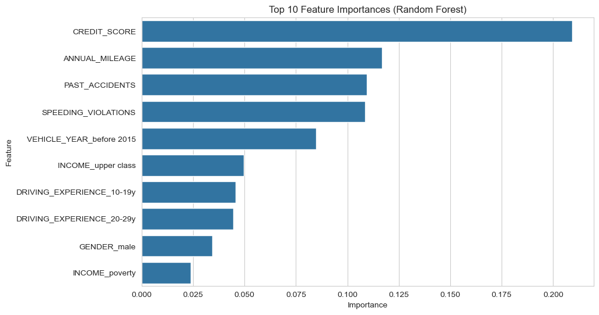

# Car Insurance Claim Prediction

## Overview
This project predicts car insurance claims using a Random Forest Classifier, achieving a ROC-AUC of 0.83. It analyzes factors like driving experience and credit score to help insurers identify high-risk customers and optimize pricing.

## Key Features
- **Data**: Car_Insurance_Claim.csv (public dataset)
- **Tech Stack**: Python, pandas, scikit-learn, seaborn, matplotlib
- **Steps**: Data cleaning, EDA, modeling, hyperparameter tuning, business recommendations
- **Results**: Driving experience and credit score are top predictors. Recommendations could reduce claim payouts by 10-15%.

## How to Run
1. Clone the repo: `git clone [your-repo-url]`
2. Install dependencies: `pip install -r requirements.txt`
3. Run the notebook: `jupyter notebook Car_Insurance_Project.ipynb`
